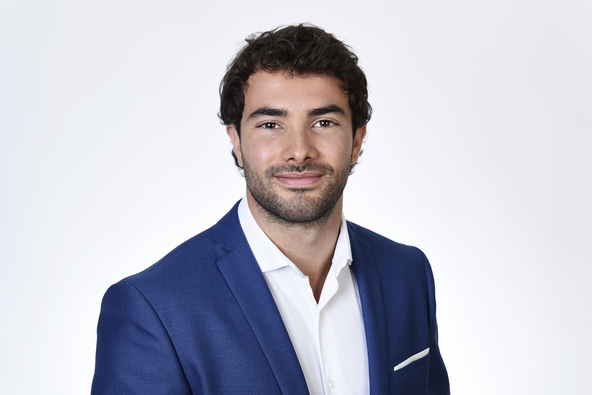
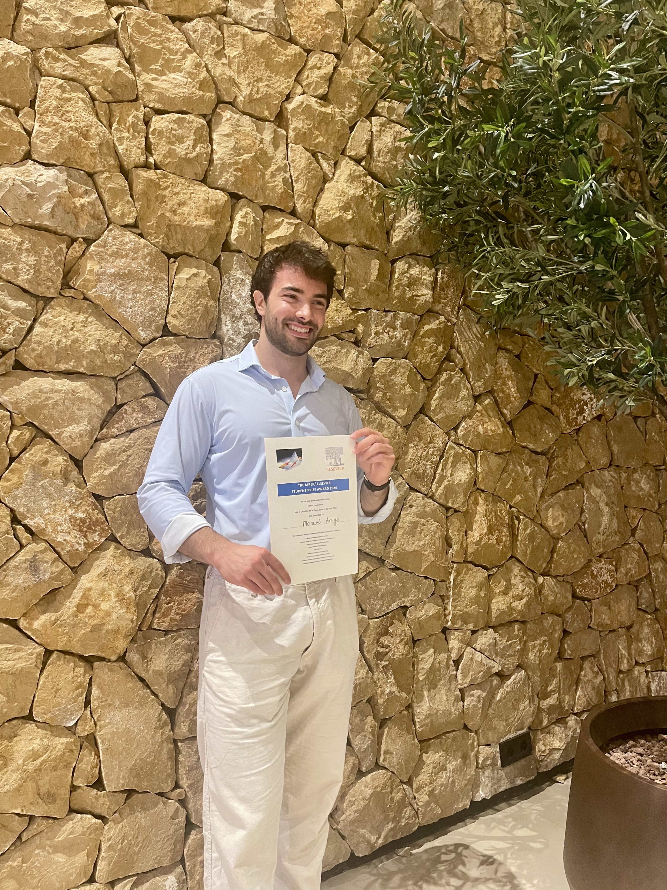

```{=html}
<style>
.hero-portrait-mobile {
  display: none;
}

@media (max-width: 700px) {
  .hero > .hero-portrait {
    display: none;
  }

  .hero-portrait-mobile {
    display: block;
    margin: 1.35rem 0 1.15rem;
    max-width: 290px;
  }

  .profile-links > p {
    display: flex;
    flex-wrap: wrap;
    gap: 0.65rem;
    margin: 0;
    width: 100%;
  }

  .profile-link {
    align-items: center;
    display: inline-flex;
    line-height: 1.25;
  }
}
</style>
```

::: {.page-shell}

::: {.hero}
::: {.hero-copy}
<p class="eyebrow">Applied microeconomics · Behavioral economics · Sports economics</p>

# Manuel Arrigo

<p class="hero-role">PhD Candidate in Sport Economics</p>
<p class="hero-affiliation">University of Lausanne</p>

::: {.hero-portrait .hero-portrait-mobile}
{.hero-photo alt="Portrait of Manuel Arrigo"}
:::

Hi, I'm Manuel. Welcome to my website. I use economics to better understand everyday decisions, behavior, and markets. My work draws mainly on applied microeconomics and behavioral economics, with a particular interest in discrimination, reactions to luck, and how people form valuations and make decisions. I often use sport as a natural setting for these questions: incentives are strong, outcomes are observable, and rich data make it possible to study behavior in real-world, competitive environments.

::: {.profile-links}
[Email](mailto:manuel.arrigo@unil.ch){.profile-link}
[CV](cv.qmd){.profile-link}
[Google Scholar](https://scholar.google.com/citations?user=iHaCbr8AAAAJ){.profile-link}
[ORCID](https://orcid.org/0009-0005-3251-9645){.profile-link}
[LinkedIn](https://ch.linkedin.com/in/manuelarrigo){.profile-link}
:::
:::

::: {.hero-portrait}
{.hero-photo alt="Portrait of Manuel Arrigo"}
:::
:::

::: {.section-block}
::: {.section-heading}
## Selected Research

[View all research →](research.qmd){.text-link}
:::

::: {.research-grid}
::: {.research-card}
<!-- Add a public paper URL here when one becomes available. -->
### [Discrimination Without Wage Gaps?](research.qmd#discrimination-without-wage-gaps-racial-preferences-and-workplace-segregation-in-a-virtual-labor-market){.paper-title-link}

Racial Preferences and Workplace Segregation in a Virtual Labor Market

<p class="coauthors">with Carlos Gómez-González, Alfredo Fantetti, and Markus Lang</p>
:::

::: {.research-card}
### [When Good Luck Turns Against You](https://papers.ssrn.com/sol3/papers.cfm?abstract_id=5730303){.paper-title-link}

Performance Responses to Noisy Intermediate Outcomes

<p class="coauthors">with Carlos Gómez-González and Markus Lang</p>
:::

::: {.research-card}
### [Sport Stadiums and Urban Economic Development](https://papers.ssrn.com/sol3/papers.cfm?abstract_id=7089892){.paper-title-link}

Evidence from Nightlight Data in Europe

<p class="coauthors">with Sara Suárez-Fernández, Carlos Gómez-González, and Markus Lang</p>
:::
:::
:::

:::: {.section-block}
<p class="section-kicker">Recent & upcoming</p>

::: {.recent-strip}
::: {.recent-photo-wrap}
{.award-photo alt="Manuel Arrigo with the IAREP Elsevier Student Prize certificate"}
:::

::: {.recent-list}
::: {.recent-item}
<span class="recent-date">2026</span>

**IAREP/Elsevier Student Prize Award**  
Best Paper Award for *Discrimination Without Wage Gaps?*
:::

::: {.recent-item}
<span class="recent-date">2026–present</span>

**PhD Representative**  
European Sport Economics Association (ESEA)
:::

::: {.recent-item .travel-placeholder}
<span class="recent-date">February–March 2027</span>

**Research Stay in Osaka, Japan**  
Visiting research stay
:::
:::
:::
:::

:::

