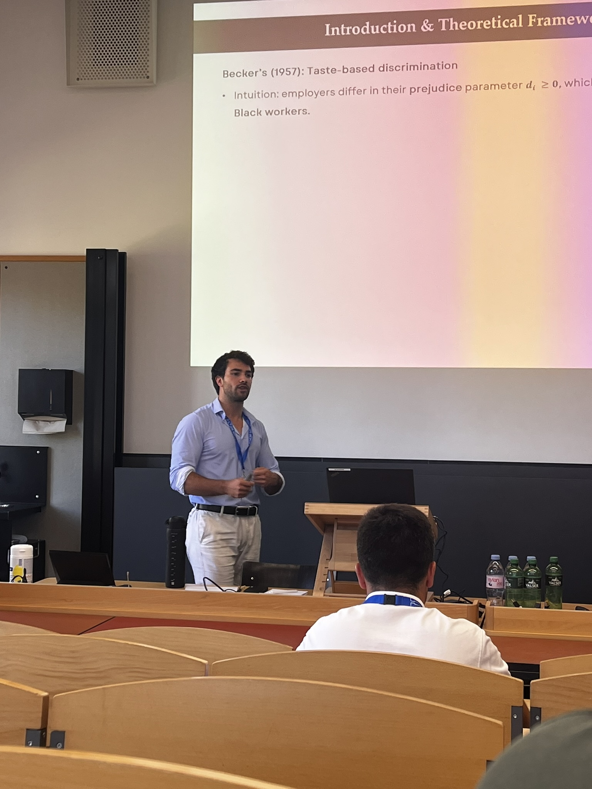

```{=html}
<style>
.paper-body .coauthors + p,
.project-copy .coauthors + p {
  margin-top: 1rem;
}
</style>
```

::: {.page-shell .inner-page}

::: {.research-hero}
::: {.research-hero-copy}
<p class="page-title" role="heading" aria-level="1">Research</p>

My research focuses on applied microeconomics and behavioral economics, often using sports settings and data to study individual behavior, markets, and organizations. I also work on broader questions in sports economics.
:::

::: {.research-hero-image}
{alt="Manuel Arrigo presenting research at a conference"}
:::
:::

::: {.research-section}
## Working Papers

::: {.paper-list}
::: {.paper-entry}
<span class="paper-number">01</span>

::: {.paper-body}
### Discrimination Without Wage Gaps? Racial Preferences and Workplace Segregation in a Virtual Labor Market
<!-- Add a public paper URL here when one becomes available. -->

<p class="coauthors">with Carlos Gómez-González, Alfredo Fantetti, and Markus Lang</p>

We test two implications of Becker’s theory of taste-based discrimination, examining how racial preferences shape workplace sorting and segregation in a highly competitive, information-rich setting.

<span class="topic-tag">Labor</span> <span class="topic-tag">Discrimination</span> <span class="topic-tag">Markets</span>
:::
:::

::: {.paper-entry}
<span class="paper-number">02</span>

::: {.paper-body}
### [When Good Luck Turns Against You: Performance Responses to Noisy Intermediate Outcomes](https://papers.ssrn.com/sol3/papers.cfm?abstract_id=5730303){.paper-title-link}

<p class="coauthors">with Carlos Gómez-González and Markus Lang</p>

We study how performers respond when intermediate outcomes exceed or fall short of underlying performance, isolating behavioral responses to noisy feedback.

<span class="topic-tag">Behavioral</span> <span class="topic-tag">Information</span> <span class="topic-tag">Performance</span>
:::
:::

::: {.paper-entry}
<span class="paper-number">03</span>

::: {.paper-body}
### [Sport Stadiums and Urban Economic Development: Evidence from Nightlight Data in Europe](https://papers.ssrn.com/sol3/papers.cfm?abstract_id=7089892){.paper-title-link}

<p class="coauthors">with Sara Suárez-Fernández, Carlos Gómez-González, and Markus Lang</p>

We study how European stadium openings affect local economic activity using high-frequency, high-resolution nighttime-light satellite data.

<span class="topic-tag">Urban</span> <span class="topic-tag">Causal inference</span> <span class="topic-tag">Nightlights</span>
:::
:::

::: {.paper-entry}
<span class="paper-number">04</span>

::: {.paper-body}
### [Who Sees Politics in Sports? Norm Endorsement and Partisan Judgments from the 2026 World Cup](https://osf.io/preprints/socarxiv/gtjp4_v1){.paper-title-link}

<p class="coauthors">with Morgan Wack, Daniel Vogler, Christian Pipal, and Lucas Paulo da Silva</p>

We examine when people interpret conduct in sport as political and how norm endorsement and partisanship shape those judgments.

<span class="topic-tag">Political economy</span> <span class="topic-tag">Norms</span> <span class="topic-tag">Judgment</span>
:::
:::
:::
:::

::: {.research-section}
## Work in Progress

::: {.project-card .research-project}
::: {.project-copy}
### Luck and Random Assignment

<p class="coauthors">with Alessandro Castagnetti</p>

Using professional tennis data, we study how luck generated by random draws affects subsequent performance and whether these effects persist over the longer term.
:::

<span class="status-pill">In progress</span>
:::
:::

::: {.research-section}
## Publications

::: {.publication-list}
::: {.publication-entry}
<span class="publication-year">2026</span>

::: {.publication-body}
### [The Impact of Communicating CSR Initiatives During Large Sports Events on Audience Attitudes, Social Norms and Intended Behavior – The Case of the Football Euro 2024 Tournament](https://doi.org/10.1080/24704067.2026.2643193){.paper-title-link}

Manuel Arrigo and Daniel Vogler. *Journal of Global Sport Management*.
:::
:::

::: {.publication-entry}
<span class="publication-year">2025</span>

::: {.publication-body}
### [Politics on the Pitch – How Is Mediatized Football Consumption Related to the Exposure to and Recall of Political Incidents During the Euro 2024?](https://doi.org/10.1177/21674795251378770){.paper-title-link}

Daniel Vogler and Manuel Arrigo. *Communication & Sport*.
:::
:::
:::
:::

:::
