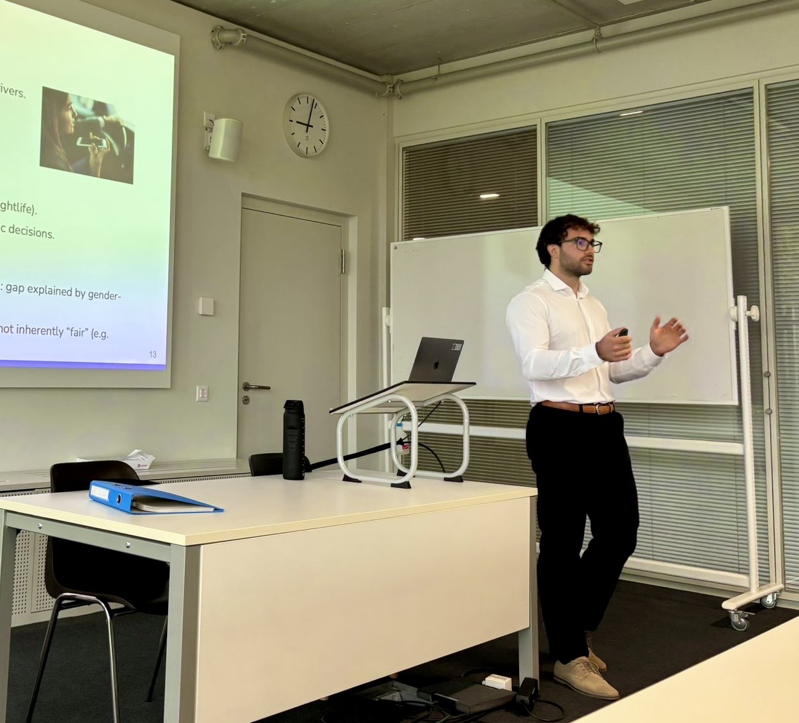

```{=html}
<style>
.course-card-top {
  align-items: center;
  display: flex;
  gap: 0.7rem;
  justify-content: space-between;
  margin-bottom: 1.2rem;
  width: 100%;
}

.course-card-top .course-level,
.course-card-top .course-term {
  margin: 0;
}

.course-card-top .course-term {
  color: var(--muted);
  font-size: 0.72rem !important;
  font-weight: 650 !important;
  letter-spacing: 0.025em;
}

.course-note-below {
  margin: 1rem 0 0;
}

.lectures-label {
  margin: 0 0 0.3rem;
}

.lectures-label + ul {
  margin-top: 0;
}
</style>
```

::: {.page-shell .inner-page}

::: {.teaching-hero}
::: {.teaching-hero-copy}
<p class="page-title" role="heading" aria-level="1">Teaching</p>

I teach and support courses at BA and MA level at the University of Lausanne.
:::

::: {.teaching-hero-image}
{alt="Manuel Arrigo teaching at the University of Lausanne"}
:::
:::

::: {.section-block .courses-section}
## Courses

::: {.course-grid}
::: {.course-card}
<div class="course-card-top"><span class="course-level">MA</span><span class="course-term">Fall 2025–present</span></div>

### Global Economy of Sport

<p class="course-meta"><span>Teaching assistant and lecturer</span><span>🇬🇧 English</span></p>

<p class="lectures-label"><strong>Lectures</strong></p>

- Discrimination
- Sports Demand & Pricing Decisions
- Sports Labor Market
- Digitalization and eSports
:::

::: {.course-card}
<div class="course-card-top"><span class="course-level">MA</span><span class="course-term">Spring 2025–present</span></div>

### Project Management

<p class="course-meta"><span>Teaching assistant</span><span>🇫🇷 Français</span></p>
:::

::: {.course-card}
<div class="course-card-top"><span class="course-level">BA</span><span class="course-term">Spring 2025–present</span></div>

### Introduction to Sport Economics

<p class="course-meta"><span>Teaching assistant and lecturer</span><span>🇫🇷 Français</span></p>

<p class="lectures-label"><strong>Lectures</strong></p>

- La médiatisation du spectacle sportif
- Spécificités du marché du travail
:::
:::

<p class="course-note course-note-below">For courses in which I lecture, only the sessions I teach personally are listed above.</p>
:::

:::
